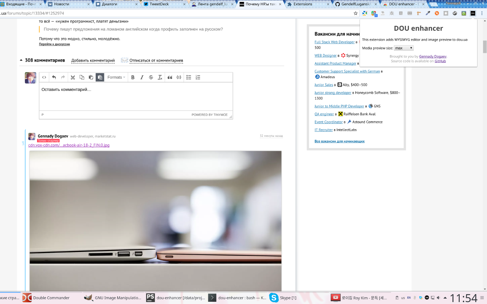

This repo contains source code for DOU Enhancer - Chrome extension that adds WYSIWYG editor and 
images preview to dou.ua

## Building

Run `gulp build` to build extension or `gulp` to build extension and watch for changes

## Reference

[Getting Started: Building a Chrome Extension](https://developer.chrome.com/extensions/getstarted)
