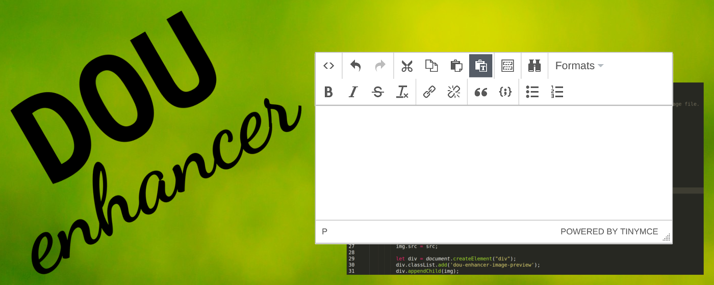

This repo contains source code for DOU Enhancer - Chrome extension that adds WYSIWYG editor and 
images preview to dou.ua

## Features

* Adds WYSIWYG editor for comments
* Highlights code in comments (only if code was inserted using WYSIWYG editor)
* Adds image previews below comment's text (if comment contains link to image). Image
can be opened in lightbox.
* Adds previews for YT videos (if comment contains link to video). Video can be player in
lightbox.
* Image previews and embedded video can be switched off, if you don't like them
* Expands all threads (can be switched off)
* Replaces utf-8 emoji with [twemoji](https://github.com/twitter/twemoji)

## Installation

You can install it from [chrome store](https://chrome.google.com/webstore/detail/dou-enhancer/nhklbdmnfeelpcppmpbgldeamflkijdn)

## Development

1. You will need installed npm (install node.js for this) and gulp (`npm install -g gulp`)
2. Clone this repo and run `npm i` to install dependencies
3. Run `gulp` to build extension and watch for changes (to auto-rebuild) or `gulp build` to build
without watching. Other available commands:
* `gulp eslint` Checks js code (except 3rd-party files) with eslint
* `gulp package` Builds extension and creates zip-archive which can be uploaded to chrome store
4. In chrome navigate to `chrome://extensions/`, tick "Developer mode" checkbox and press 
"Load unpacked extension". Select `dist` folder.

All code that can be changed is in [src](src) directory. Files in src, such as 
[background.js](background.js), [content.js](content.js) and [popup.js](popup.js), will be
processed with webpack and babel, so ES6 syntax and imports can be used. [Utils](utils) and
[config](config) directories contain modules which can be imported. [Static](static) directory
contains files that should be copied into dist without processing (like manifest, images or 
3rd-party files). Look into [gulpfile](gulpfile.js) for details.

## Reference

[Getting Started: Building a Chrome Extension](https://developer.chrome.com/extensions/getstarted)
